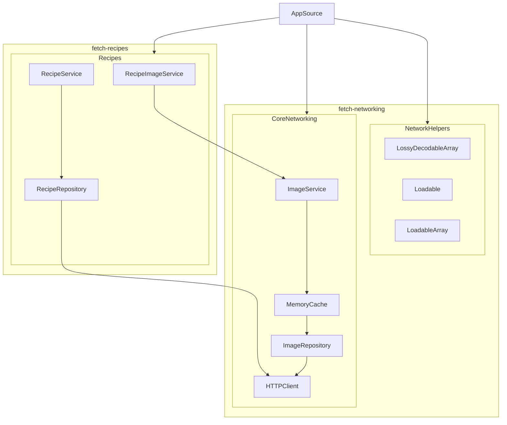

## Summary: Include screenshots or a video of your app highlighting its features


https://github.com/user-attachments/assets/d026c49b-de1c-4600-9d45-d0199a990d2d


## Focus Areas: What specific areas of the project did you prioritize? Why did you choose to focus on these areas?

For this project, I focused on four key areas:
- **Modularization** (using Swift Package Manager for local packages)
- **Simple yet opinionated interfaces** (drawing inspiration from Type Driven Development as presented by [Alex Ozun](https://www.youtube.com/watch?v=cCZ00b_RNyc&t=1631s))
- **Repositories with composable services**
- **Swift Testing Framework**

---

### Modularization:

> Modularization is crucial for creating maintainable and scalable software espcially with a large team.
>
> By breaking the code into smaller, independent packages, I can ensure that each part of the application is focused on a single responsibility. This makes testing, debugging, and future modifications easier while also encouraging reusability across different projects.

I used two separate packages:
- `fetch-networking`: A networking package containing the following modules/libraries:
   - **CoreNetworking**:
       - Contains core networking structs, caching mechanisms, network clients, along with the implementation of `ImageRepository` and `ImageService`.
   - **NetworkHelpers**:
       - Contains helpful wrapper types and property wrappers related to networking, such as `Loadable`, `LoadableArray`, and `LossyDecodableArray`.
   - **NetworkMocks**:
       - Contains `MockHTTPClient`, `MockImageService`, and other helpful extensions for testing both within and outside of `fetch-networking`.
- `fetch-recipes`: A package containing a single module for simplicity:
  - **Recipe**:
      - Contains all `Recipe`-specific repositories, services, and structs.

---

### Simple Yet Opinionated Interfaces:

> Opinionated interfaces are essential because they define clear contracts for the services, improving consistency and type safety.
>
> By using type constraints and well-defined methods, I can ensure that the interfaces are predictable, easy to use, and enforce the necessary guarantees about the data they handle.

The goal was to provide a type-safe and thread-safe way to access the data needed for the ViewModels. After implementing a generic `MemoryCache`, I explored ways to abstract out the generics and create simple yet opinionated interfaces.

Here are two examples of the interfaces:
```swift
/// A service responsible for fetching recipe images.
public protocol RecipeImageServicing: Sendable {
    /// Fetches the small-sized image for a given recipe.
    ///
    /// - Parameter recipe: The `Recipe` for which the small image is being fetched.
    /// - Returns: The corresponding small `Image`.
    nonisolated func fetchSmallImage(_ recipe: Recipe) async throws -> Image

    /// Fetches the large-sized image for a given recipe.
    ///
    /// - Parameter recipe: The `Recipe` for which the large image is being fetched.
    /// - Returns: The corresponding large `Image`.
    nonisolated func fetchLargeImage(_ recipe: Recipe) async throws -> Image
}
```
and

```swift
/// A service responsible for fetching recipes.
public protocol RecipeServicing: Sendable {
    /// Fetch Image for given path
    /// - Parameters:
    ///    - requestType: ``RecipeService.RequestType`` representing the different test data
    /// - Returns: ``[Recipe]``
    nonisolated func fetchRecipes(
        _ requestType: RecipeService.RequestType // only needed for switching endpoints on the fly
    ) async throws -> [Recipe]
}
```

---

### Repositories with Composable Services:
> The goal in this section was to keep `RecipeImageServicing` and `RecipeServicing` highly opinionated and type-constrained.
>
> While these simple interfaces could have been implemented with a single class, I wanted to explore how composable the entire structure could be. I also wanted to challenge myself with generics and strict concurrency.

Below is a diagram illustrating the structure of the `RecipeImageService` and `RecipeService`, showing the composable services, caches, and repositories.



---

### Swift Testing Framework:
> At my day job, we primarily use XCTest, so I haven't had the chance to explore the new Swift Testing framework in-depth. For this project,
>
> I focused most of my test coverage on the two packages (`fetch-networking` and `fetch-recipes`) since the ViewModels were relatively simple. I wanted to assess how much coverage I could achieve within the core logic of these packages.

Final test coverage numbers:


## Time Spent: Approximately how long did you spend working on this project? How did you allocate your time?
> Around 10 hours (I spent extra time learning about `Swift Testing` and achieving high test coverage):
> - 2 hours building `CoreNetworking` with `HTTPClient`, `MemoryCache`, `ImageRepository`, and `ImageService`
> - 1 hour building `RecipeRepository` and `RecipeService`
> - 2 hours writing unit tests and learning `Swift Testing`
>   - Used `URLProtocolMock` for most of the tests but eventually backed it out
> - 2 hours building `RecipeList` (initially doing the work for `RecipeImageService` inside the ViewModel, which I later abstracted out)
> - 1 hour building `RecipeImageService`
> - 2 hours finishing unit tests (backed out the use of `URLProtocolMock`)
> - 1 hour polishing the UI and adding `RecipeDetailView`

## Trade-offs and Decisions: Did you make any significant trade-offs in your approach?

> I decided to modularize the project into two distinct packages:
> One significant decision I made was to use an actor for the `MemoryCache`. I wanted to dive deeper into actor reentrancy, especially because using actors for caching with a network layer internally can be problematic.
> 
> Using an actor above network requests also enables better concurrency control, ensuring that network calls aren't called on the `MainActor`.
> - Whether this is a major concern is a broader discussion, as network requests are primarily “waiting work” rather than “doing work.”
> 
> Because of the tight coupling between the `MemoryCache` and `RemoteRepository`, this approach forces the implementer to follow this same structure.
> While this may seem restrictive, I believe the trade-off is worth it, as it enables any repository to adopt this caching mechanism in a consistent way.

> Finally, I opted not to use SwiftUI previews for this project because:
> - The full project built relatively quickly.
> - I focused most of my time on developing the service layers and didn’t prioritize UI design or customizations at this stage.


## Weakest Part of the Project: What do you think is the weakest part of your project?
> The weakest part of the project is the memory-only cache. Adding a hybrid cache solution with both in-memory and persistent storage would have been more robust but I decided to focus on other areas.

> Additionally, the design and UI aren’t polished. I chose to focus more on the service layers for this project.


## Additional Information: Is there anything else we should know? Feel free to share any insights or constraints you encountered.
> Enabling Strict Concurrency Checking with Swift 6 Language mode show so many places where issues can arise.
>
> I think this was a great size project for a take home and I hope that more companies continue to do this style interview process.
  
